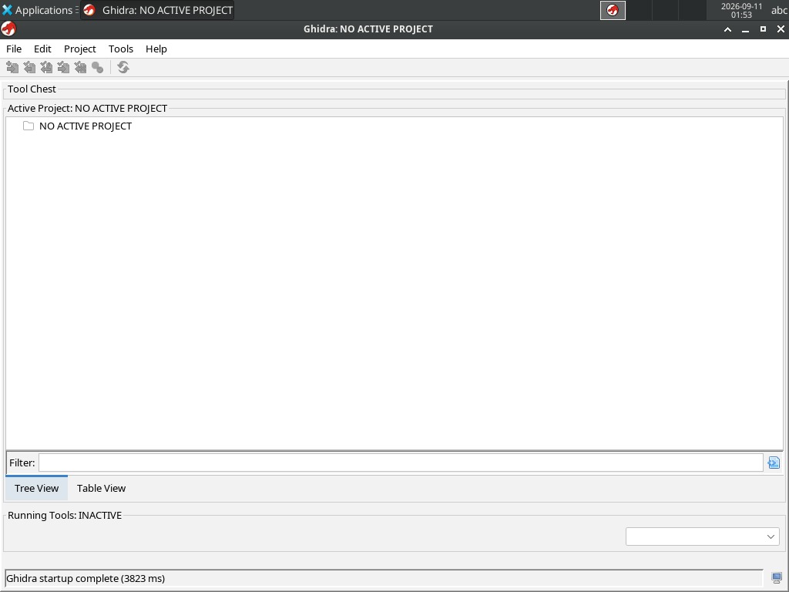
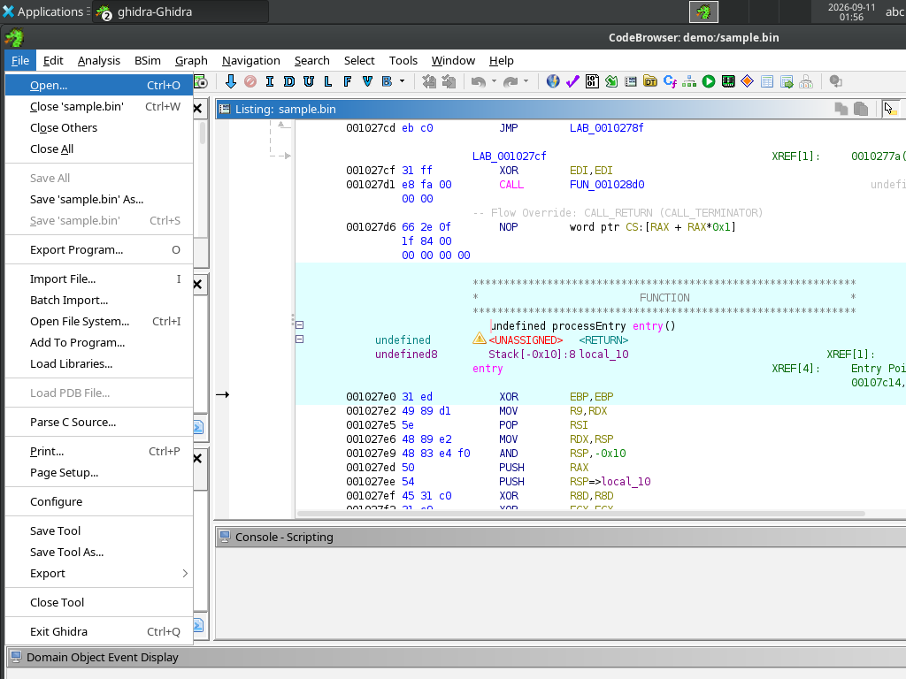
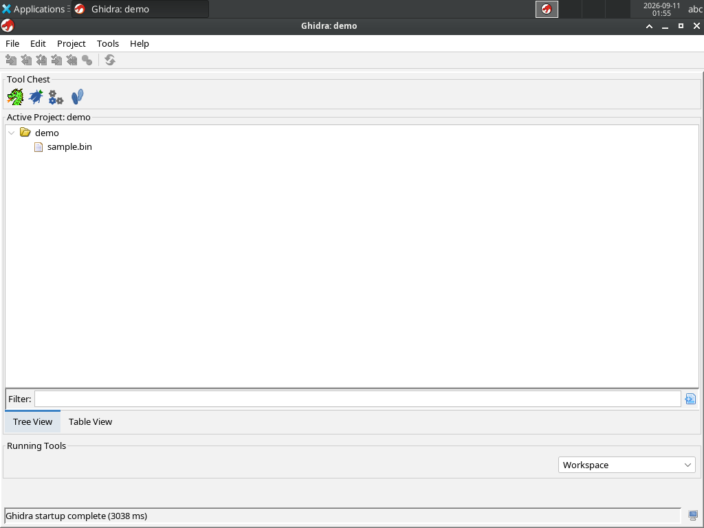
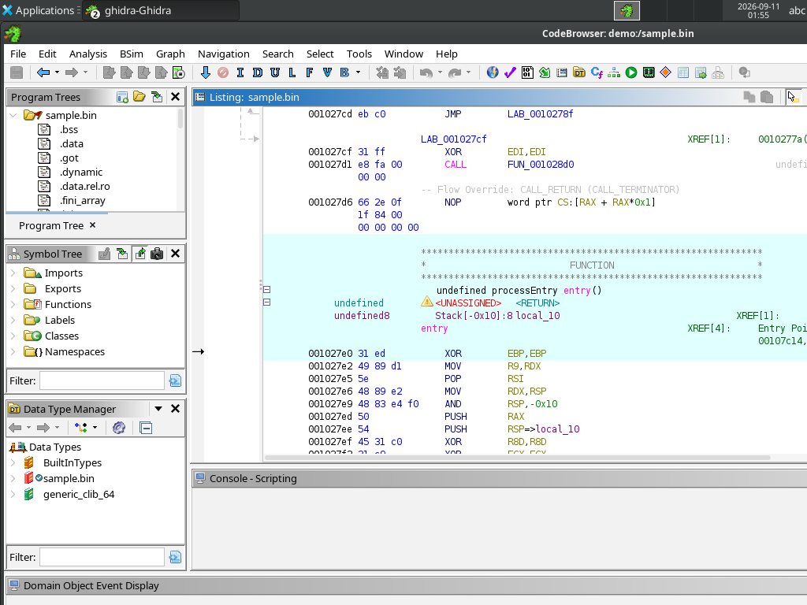

# relab

Selkies XFCE Desktop with Ghidra and LaurieWired GhidraMCP. Law is `SPEC.md`.

This tutorial gets you from `docker compose` to a live Ghidra session that an MCP client can decompile.

The test host was `relab-demo.stargazer-shark.ts.net` with Ghidra 12.1.3 and GhidraMCP 1.4. The screenshots are from that session.

## Terms

| Concept | Term |
|---------|------|
| Browser desktop | Desktop |
| LaurieWired Python MCP (SSE) | Bridge |
| LaurieWired Java HTTP API | Plugin HTTP |
| linuxserver home | `/config` |
| Operator bind for binaries and projects | `/data` |
| ts-proxy on the tailnet | Front |

## What must be running

The Bridge starts with the container. Plugin HTTP starts only after all of these are true:

1. Ghidra is open.
2. GhidraMCPPlugin is enabled in File → Configure → Developer.
3. A project is open.
4. A program is open in CodeBrowser.

Until then the Bridge answers SSE, and each tool call fails against `http://127.0.0.1:8080/`.

## Start

Need: Docker Compose, and a Tailscale account for the Front.

```
RELAB_HOSTNAME=relab-demo RELAB_CONFIG=/tmp/relab-teste/config RELAB_DATA=/tmp/relab-teste/data \
  docker compose -p relab-demo -f docker-compose.yml -f compose.tailscale.yml up
```

Watch `relab-demo-ts-proxy` logs for the first-run Tailscale login URL. Later starts reuse `./ts-proxy-state/relab-demo`.

Open the Desktop:

```
https://relab-demo.<tailnet>.ts.net
```

Example from the test host: `https://relab-demo.stargazer-shark.ts.net`.

HTTP on port 80 also works. Use HTTPS. Selkies needs a secure context for WebCodecs.

The overlay does not publish host ports. Recreate `ts-proxy` after you change `examples/ts-proxy.yaml`.

## Open Ghidra

On the Desktop, start Ghidra from Applications, or run `ghidraRun` in a terminal.

The first window is the project window. There is no active project yet.



A note on the XFCE desktop (`GHIDRA-MCP.txt`) lists the same steps.

## Enable GhidraMCPPlugin

Do this once per `/config` (once per `RELAB_CONFIG`).

1. In the project window or in CodeBrowser, open **File**.
2. Choose **Configure**.
3. Open **Developer**.
4. Enable **GhidraMCPPlugin**.
5. Restart Ghidra if it asks.



The image already extracted the extension into the Ghidra install tree. You do not use File → Install Extensions unless you replace the plugin.

## Create a project and import a binary

1. File → New Project. Choose a non-shared project.
2. Put the project under `/data` so it stays on `RELAB_DATA`.
3. File → Import File. Import a binary from `/data`.
4. Let auto-analysis finish.

The test session imported `/data/sample.bin` into `/data/projects/demo`. After you open that project, the tree shows the file:



## Open CodeBrowser

Double-click the program in the project tree. CodeBrowser must stay open. Plugin HTTP listens on `127.0.0.1:8080` only while this tool has a program.



## Connect an MCP client

Bridge URLs after the Desktop is up:

| URL | Use |
|-----|-----|
| `https://relab-demo.<tailnet>.ts.net/mcp/sse` | SSE through Selkies nginx |
| `http://relab-demo.<tailnet>.ts.net:8081/sse` | SSE on the Bridge port |

Cline (and other remote SSE clients):

1. Transport: SSE.
2. URL: `https://relab-demo.<tailnet>.ts.net/mcp/sse`.

Claude Desktop / stdio clients cannot reach a remote SSE URL directly. Run the Bridge script locally only if the Plugin HTTP is on the same machine. On this image, use an SSE-capable client against the URLs above.

Example stdio config is for a local Bridge only:

```json
{
  "mcpServers": {
    "ghidra": {
      "command": "python",
      "args": [
        "/opt/ghidra-mcp/bridge_mcp_ghidra.py",
        "--ghidra-server",
        "http://127.0.0.1:8080/"
      ]
    }
  }
}
```

Use the stdio JSON only from a shell inside the container (`docker exec -it relab-demo bash`). From the tailnet, use the SSE URLs in Connect an MCP client.

## What a working call looks like

On the test host, Plugin HTTP returned methods from `sample.bin`:

```
_DT_INIT
FUN_00102020
free
__vfprintf_chk
```

Decompile of `FUN_00102020`:

```
void FUN_00102020(void)

{
  (*(code *)PTR_00109e58)();
  return;
}
```

SSE on both Bridge URLs started with:

```
event: endpoint
data: /messages/?session_id=...
```

If you see `Request failed` or `Connection refused` on tools, CodeBrowser does not have a program, or GhidraMCPPlugin is off.

## Local apply (no Front)

```
docker compose up --build
```

Open `https://localhost:3001` and accept the self-signed certificate.

MCP:

- `http://localhost:8081/sse`
- `https://localhost:3001/mcp/sse`

## Image

CI builds `linux/amd64` and pushes `ghcr.io/<owner>/relab` on `master`/`main` and on `v*` tags. Pull requests run the checks and bake the image without pushing.

```
docker pull ghcr.io/<owner>/relab:latest
```

Point `image:` in `docker-compose.yml` at that tag when you do not want to bake locally.

## More than one instance

`RELAB_HOSTNAME` is the Tailscale node name. Default is `relab`. Use a new value and a new compose project per instance.

```
RELAB_HOSTNAME=lab-alice RELAB_CONFIG=./alice/config RELAB_DATA=./alice/data \
  docker compose -p lab-alice -f docker-compose.yml -f compose.tailscale.yml up
```

Tailscale state is `./ts-proxy-state/<RELAB_HOSTNAME>`. Funnel is off. To use an auth key, set `TS_AUTHKEY` and uncomment the `tokens` block in `examples/ts-proxy.yaml`.
